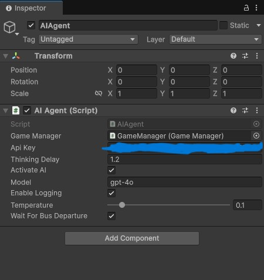

# Bus Jam AI Agent Implementation

This document explains how to set up and use the AI agent to play the Bus Jam game automatically.

## Overview

The AI agent uses OpenAI's GPT model to analyze the game state and make decisions about which passengers to move. The agent can complete all levels of the game by applying strategic reasoning and optimized path-finding.

## Implementation Details

The implementation uses `AIAgent.cs`, which handles all the AI logic that interacts with the OpenAI API and controls the game.

## Setup Instructions

### 1. Add the Script to the Project

- Place `AIAgent.cs` in the `Assets/Scripts` folder
- Create a new GameObject in your scene and attach the `AIAgent` component to it
- GameObject Settings: (I used gpt-4o for final tests, you can use whatever you want. recomendation o3-mini)
- 

### 2. Configure the AI Agent

- Set your OpenAI API key in the Inspector for the AIAgent component
- By default, the agent developed with gpt-4o-mini for minimum cost, but you MUST switch gpt-4o for test and you may switch to o3-mini for better performance
- Adjust the thinking delay as needed (1.2 is fine for this settings)

### 3. Run the Game

- Press Play in the Unity Editor
- The AI will automatically start playing the game if `activateAI` is enabled

## How the AI Works

1. **Game State Capture**: The agent captures the current game state, including:
   - The grid layout with passenger positions and colors
   - Current bus color and status
   - Waiting area occupancy

2. **Path Analysis**: The agent uses an optimized path-finding algorithm to:
   - Find matching passengers that can be moved to the bus
   - Calculate the cost of moving each passenger (number of blockers + 1)
   - Identify the most efficient path to the top for each matching passenger

3. **Decision Making**: Using OpenAI's API, the agent analyzes the state and decides:
   - Which passenger to move next based on move cost optimization
   - Whether to move directly to the bus or clear blockers first
   - Strategic planning to clear the level with minimal moves

4. **Action Execution**: The agent simulates clicking on the selected passenger

5. **Logging and Analysis**: If enabled, the agent logs all actions and game states to a file for later review. Logging into C:\Users\\`username`\AppData\LocalLow\Rollic\AIBusJam\AILogs

## Key Features

### Optimized Path-Finding

The path-finding system uses a multi-tiered approach:
1. First checks for a direct vertical path (fastest route)
2. If no direct path exists, performs a breadth-first search (BFS) to find any possible path to the top
3. Accounts for all possible movements (up, down, left, right)

### Move Cost Optimization

The AI prioritizes passengers based on move cost, calculated as:
- Move cost = Number of blockers + 1
- Lower cost passengers are always chosen first

### Simplified Color Handling

The color system uses direct comparisons for efficiency and reliability:
- Direct equality comparison between colors (`c1 == c2`)
- Accurate color identification for all 10 game colors
- Consistent color coding for visualization

## Strategy

The AI agent uses the following strategy:

1. Always prioritize moving matching-color passengers that have clear paths to the top
2. If no clear paths exist, choose the matching passenger with the lowest move cost
3. Move blockers strategically to create paths for matching passengers
4. Use the waiting area sparingly and only for blockers

## Customization

You can adjust various parameters to change how the AI behaves:

- **Temperature**: Controls the randomness of the AI's decisions (higher values = more exploration)
- **Thinking Delay**: Time between decisions (lower values allow the AI to play faster but may cause game states to stack)
- **Model**: Select between gpt-4o-mini (faster for development) and gpt-4o (more sophisticated for using) and o3-mini (for speed/accuracy)
- **Wait For Bus Departure**: If enabled, the AI will wait for buses to depart before making the next move

## Logging

The AI agent can log its decision-making process to help with debugging and analysis:

- Enable logging in the inspector
- Logs are saved to `[Application.persistentDataPath]/AILogs/`
- Each log file contains the game state, decisions, and actions taken

## Troubleshooting

- **API Key Issues**: Ensure your OpenAI API key is valid and has sufficient quota
- **Slow Performance**: Try increasing the thinking delay or switching to a faster model
- **Incorrect Decisions**: Adjust the temperature parameter or switch to gpt4.5 or o3-mini for better reasoning

---

Created by [Mehmet Ünlü](https://www.linkedin.com/in/daymenion/) for the Rollic AI GamePlay Agent Case Study Project.
